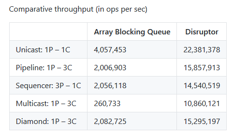
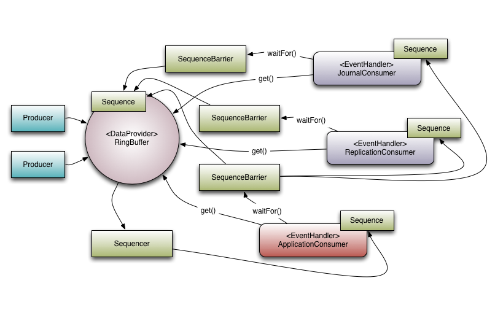
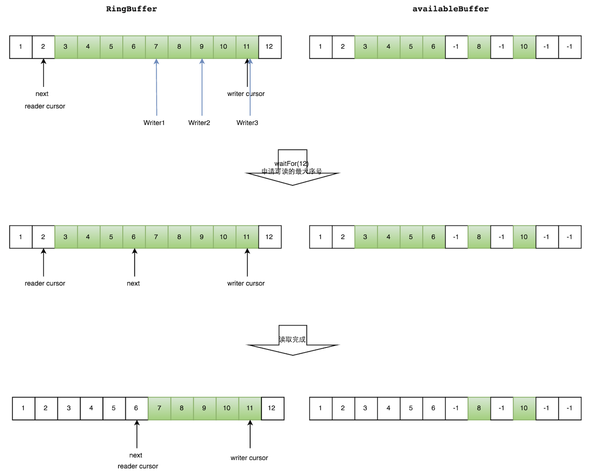
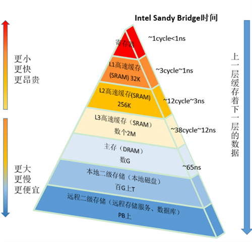
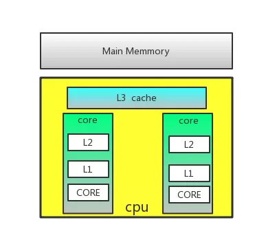

####  Disruptor高性能队列使用以及原理分析

Disruptor是英国外汇交易公司LMAX开发的一个高性能队列，研发的初衷是解决内存队列的延迟问题（在性能测试中发现竟然与I/O操作处于同样的数量级）。基于Disruptor开发的系统单线程能支撑每秒600万订单，2010年在QCon演讲后，获得了业界关注。2011年，企业应用软件专家Martin Fowler专门撰写长文介绍。同年它还获得了Oracle官方的Duke大奖。目前，包括Apache Storm、Camel、Log4j 2在内的很多知名项目都应用了Disruptor以获取高性能。

disruptor作用与ArrayBlockingQueue有相似之处，但是disruptor从功能、性能都远好于ArrayBlockingQueue，当多个线程之间传递大量数据或对性能要求较高时，可以考虑使用disruptor作为ArrayBlockingQueue的替代者。官方也对disruptor和ArrayBlockingQueue的性能在不同的应用场景下做了对比，本文列出其中一组数据，数据中P代表producer，C代表consumer，ABS代表ArrayBlockingQueue，**目测性能只有有5~10倍左右的提升**。

##### 结构

**Sequence**

首先Sequence是一个递增的序号，就是一个计数器；其次，由于需要在线程间共享，所以Sequence是引用传递，并且是线程安全的；再次，Sequence支持CAS操作；最后，为了提高效率，Sequence通过padding来避免伪共享。

**RingBuffer**

 RingBuffer是存储消息的地方，通过一个名为cursor的Sequence对象指示队列的头，协调多个生产者向RingBuffer中添加消息，并用于在消费者端判断RingBuffer是否为空。巧妙的是，表示队列尾的Sequence并没有在RingBuffer中，而是由消费者维护。这样的好处是多个消费者处理消息的方式更加灵活，可以在一个RingBuffer上实现消息的单播，多播，流水线以及它们的组合。其缺点是在生产者端判断RingBuffer是否已满是需要跟踪更多的信息，为此，在RingBuffer中维护了一个名为gatingSequences的Sequence数组来跟踪相关Seqence

**SequenceBarrier**

 SequenceBarrier用来在消费者之间以及消费者和RingBuffer之间建立依赖关系。在Disruptor中，依赖关系实际上指的是Sequence的大小关系，消费者A依赖于消费者B指的是消费者A的Sequence一定要小于等于消费者B的Sequence，这种大小关系决定了处理某个消息的先后顺序。因为所有消费者都依赖于RingBuffer，所以消费者的Sequence一定小于等于RingBuffer中名为cursor的Sequence，即消息一定是先被生产者放到Ringbuffer中，然后才能被消费者处理。

SequenceBarrier在初始化的时候会收集需要依赖的组件的Sequence，RingBuffer的cursor会被自动的加入其中。需要依赖其他消费者和/或RingBuffer的消费者在消费下一个消息时，会先等待在SequenceBarrier上，直到所有被依赖的消费者和RingBuffer的Sequence大于等于这个消费者的Sequence。当被依赖的消费者或RingBuffer的Sequence有变化时，会通知SequenceBarrier唤醒等待在它上面的消费者。

1. 工作流程

Producer会向这个RingBuffer中填充元素，填充元素的流程是首先从RingBuffer读取下一个Sequence，之后在这个Sequence位置的槽填充数据，之后发布。
Consumer消费RingBuffer中的数据，通过SequenceBarrier来协调不同的Consumer的消费先后顺序，以及获取下一个消费位置Sequence。
Producer在RingBuffer写满时，会从头开始继续写，替换掉以前的数据。但是如果有SequenceBarrier指向下一个位置，则不会覆盖这个位置，阻塞到这个位置被消费完成。Consumer同理，在所有Barrier被消费完之后，会阻塞到有新的数据进来。

读数据多线程写入流程：

1. 申请读取到序号n；
2. 若writer cursor >= n，这时仍然无法确定连续可读的最大下标。从reader cursor开始读取available Buffer，一直查到第一个不可用的元素，然后返回最大连续可读元素的位置；
3. 消费者读取元素。

如下图所示，读线程读到下标为2的元素，三个线程Writer1/Writer2/Writer3正在向RingBuffer相应位置写数据，写线程被分配到的最大元素下标是11。

读线程申请读取到下标从3到11的元素，判断writer cursor>=11。然后开始读取availableBuffer，从3开始，往后读取，发现下标为7的元素没有生产成功，于是WaitFor(11)返回6。

写数据

多个生产者写入的时候：

1. 申请写入m个元素；
2. 若是有m个元素可以写入，则返回最大的序列号。每个生产者会被分配一段独享的空间；
3. 生产者写入元素，写入元素的同时设置available Buffer里面相应的位置，以标记自己哪些位置是已经写入成功的。

如下图所示，Writer1和Writer2两个线程写入数组，都申请可写的数组空间。Writer1被分配了下标3到下表5的空间，Writer2被分配了下标6到下标9的空间。

Writer1写入下标3位置的元素，同时把available Buffer相应位置置位，标记已经写入成功，往后移一位，开始写下标4位置的元素。Writer2同样的方式。最终都写入完成。

2.等待策略

消费者

|            名称             |           措施            |                           适用场景                           |
| :-------------------------: | :-----------------------: | :----------------------------------------------------------: |
|    BlockingWaitStrategy     |           加锁            |           CPU资源紧缺，吞吐量和延迟并不重要的场景            |
|    BusySpinWaitStrategy     |           自旋            | 通过不断重试，减少切换线程导致的系统调用，而降低延迟。推荐在线程绑定到固定的CPU的场景下使用 |
|  PhasedBackoffWaitStrategy  | 自旋 + yield + 自定义策略 |           CPU资源紧缺，吞吐量和延迟并不重要的场景            |
|    SleepingWaitStrategy     |   自旋 + yield + sleep    |          性能和CPU资源之间有很好的折中。延迟不均匀           |
| TimeoutBlockingWaitStrategy |     加锁，有超时限制      |           CPU资源紧缺，吞吐量和延迟并不重要的场景            |
|    YieldingWaitStrategy     |    自旋 + yield + 自旋    |         性能和CPU资源之间有很好的折中。延迟比较均匀          |

生产者：

暂时只有休眠1ns。

##### 性能分析

1. CAS与ReentrantLock性能比较

CAS（compareAndSet），字面意思：比较并交换。不可分割的一个原子操作。某个任务在执行过程中，要么全部成功，要么全部失败回滚，恢复到执行之前的初态，不存在初态和成功之间的中间状态。

ReentrantLock可重入锁，JUC包下提供并发控制的工具类。

性能测试代码如下：

~~~java
package test;

import sun.misc.Unsafe;

import java.lang.reflect.Field;
import java.util.concurrent.CompletableFuture;
import java.util.concurrent.CountDownLatch;
import java.util.concurrent.locks.ReentrantLock;

public class CasTest {

    private static final Unsafe unsafe = getUnsafe();
    public volatile int num = 0 ;

    private static long offset;

    static {
        try {
            offset = unsafe.objectFieldOffset(CasTest.class.getDeclaredField("num"));
        } catch (NoSuchFieldException e) {
            e.printStackTrace();
        }
    }

    private int getAndInt(int n){
        return unsafe.getAndAddInt(this,offset,n);
    }

    private boolean compareAndSwapInt(int expect,int update){
        return unsafe.compareAndSwapInt(this, offset, expect, update);
    }

    public static void main(String[] args) throws InterruptedException {
        addNumByCas();

        addNumByLock();

    }

    private static void addNumByLock() throws InterruptedException {

        long t1 = System.currentTimeMillis();
        CasTest casTest = new CasTest();
        CountDownLatch countDownLatch = new CountDownLatch(10);
        ReentrantLock reentrantLock = new ReentrantLock();
        for (int i = 0; i < 10; i++) {
            CompletableFuture.runAsync(() -> {
                for (int j = 0; j < 10000000;  j++) {
                    reentrantLock.lock();
                    casTest.num ++;
                    reentrantLock.unlock();
                }
                countDownLatch.countDown();
            });
        }
        countDownLatch.await();
        System.out.println("Lock计算结果: "+ casTest.num + ",计算耗时：" + (System.currentTimeMillis() -t1) + "ms");

    }

    private static void addNumByCas() throws InterruptedException {
        long t1 = System.currentTimeMillis();
        CasTest casTest = new CasTest();
        CountDownLatch countDownLatch = new CountDownLatch(10);
        for (int i = 0; i < 10; i++) {
            CompletableFuture.runAsync(() -> {
                for (int j = 0; j < 10000000; j++) {
                    casTest.getAndInt(j);
                }
                countDownLatch.countDown();
            });
        }
        countDownLatch.await();
        System.out.println("CAS计算结果: "+ casTest.num + ",计算耗时：" + (System.currentTimeMillis() -t1) + "ms");
    }

    private static Unsafe getUnsafe() {
        try{
            Field theUnsafe = Unsafe.class.getDeclaredField("theUnsafe");
            theUnsafe.setAccessible(true);
            return (Unsafe)theUnsafe.get(null);
        }catch (Exception e){
            e.printStackTrace();
        }
        return null;

    }

}

~~~

结论：ReentrantLock耗时比CAS多1.7倍左右。

2. 缓存行伪共享问题

距离CPU越近的缓存速度越快、容量越小、价格越贵，计算机的多级缓存模型如下图所示：

- 

其中L3级缓存为CPU多核心锁共享。

处理器为了提高处理速度，不直接和内存进行通讯，而是先将系统内存的数据读到内部缓存（L1,L2,L3）后再进行操作。在每个缓存里面都是由缓存行组成的，缓存系统中以**缓存行（cache line）**为单位存储的。在大多数的计算机中**缓存行大小是64字节**。**由于缓存行的特性，在多核CPU中当多线程修改位于同一缓存行的互相独立的变量时，为了保证缓存一致性，就会无意中影响彼此的性能，这就是伪共享**。

CPU的**缓存一致性协议**，缓存一致性协议有MSI，MESI，MOSI，Synapse，Firefly及DragonProtocol等等。最常见的协议MESI简单介绍如下：

|           状态            |                             描述                             |                           监听任务                           |
| :-----------------------: | :----------------------------------------------------------: | :----------------------------------------------------------: |
|     M 修改（Modify）      | 该缓存行有效，数据被修改了，和内存中的数据不一致，数据只存在于本缓存行中 | 缓存行必须时刻监听所有试图读该缓存行相对应的内存的操作，其他缓存须在本缓存行写回内存并将状态置为E之后才能操作该缓存行对应的内存数据 |
| E 独享、互斥（Exclusive） | 该缓存行有效，数据和内存中的数据一致，数据只存在于本缓存行中 | 缓存行必须监听其他缓存读主内存中该缓存行相对应的内存的操作，一旦有这种操作，该缓存行需要变成S状态 |
|     S 共享（Shared）      | 该缓存行有效，数据和内存中的数据一致，数据同时存在于其他缓存中 | 缓存行必须监听其他缓存是该缓存行无效或者独享该缓存行的请求，并将该缓存行置为I状态 |
|     I 无效（Invalid）     |                       该缓存行数据无效                       |                              无                              |

四种状态转换如下图所示下：

解决伪共享的方式：缓存行对其，通过填充字段让一个表里独占一个缓存行，代码如下。

没有缓存行对齐的情况下对变量x复制1000w次如下：

~~~java
package test;

public class CacheLineNoPadding {

    public static class T {
        //8字节
        private volatile long x = 0L;
    }

    private static T[] arr = new T[2];

    static {
        arr[0] = new T();
        arr[1] = new T();
    }

    public static void main(String[] args) throws InterruptedException {
        Thread thread1 = new Thread(() -> {
            for (long i = 0; i < 1000_0000L; i++) {
                //volatile的缓存一致性协议MESI或者锁总线，会消耗时间
                arr[0].x = i;
            }
        });

        Thread thread2 = new Thread(() -> {
            for (long i = 0; i < 1000_0000L; i++) {
                arr[1].x = i;
            }
        });
        long startTime = System.nanoTime();
        thread1.start();
        thread2.start();
        thread1.join();
        thread2.join();
        System.out.println("总计消耗时间：" + (System.nanoTime() - startTime) / 100_000);
    }
}
~~~

缓存行对齐的情况下对变量x复制1000w次，代码如下：

~~~Java
package test;

public class CacheLinePadding {

    private static class Padding{
        //7*8字节
        public volatile long p1,p2,p3,p4,p5,p6,p7;
    }
    public static class T extends Padding{
        //8字节
        private volatile long x = 0L;
    }
    private static T[] arr = new T[2];

    static {
        arr[0] = new T();
        arr[1] = new T();
    }

    public static void main(String[] args) throws InterruptedException {
        Thread thread1 = new Thread(()->{
            for(long i = 0;i < 1000_0000L;i++){
                //volatile的缓存一致性协议MESI或者锁总线，会消耗时间
                arr[0].x = i;
            }
        });

        Thread thread2 = new Thread(()->{
            for(long i = 0;i< 1000_0000L;i++){
                arr[1].x = i;
            }
        });
        long startTime = System.nanoTime();
        thread1.start();
        thread2.start();
        thread1.join();
        thread2.join();
        System.out.println("总计消耗时间："+(System.nanoTime()-startTime)/100_000);
    }

}

~~~

测试结论：在没有缓存行对齐的情况下，是有缓存行对齐耗时的3-4倍。

3. RingBuffer

   一个环形队列，意味着首尾相连，也就是他的大小是有限制的，但是ringbuffer是基于这样一个假设：即生产者和消费者都在同步往前走，不存在某边特别快，这样这个对列就可以循环使用，不必有创建对象的开销，另外，ringbuffer由于是固定大小的，使用数组来保存，由于预先分配好了空间，所以定位和查找的速度自然不必说。

4. 位运算替代取模操作

ringbuffer的大小长度必须是2的n次方，在计算ringbuffer数组下标的时候会与运算比直接取模运算快很多。

##### 使用

测试主类

~~~java
package test;

import com.lmax.disruptor.BlockingWaitStrategy;
import com.lmax.disruptor.RingBuffer;
import com.lmax.disruptor.dsl.Disruptor;
import com.lmax.disruptor.dsl.ProducerType;
import test.consumer.LogDataHandler;
import test.entity.LogData;
import test.producer.LogDataFactory;
import test.producer.LogDataProducer;

import java.nio.ByteBuffer;
import java.util.concurrent.Executor;
import java.util.concurrent.Executors;

public class DisruptorTest {

    private static final Executor executor = Executors.newCachedThreadPool();

    public static void main(String[] args) throws InterruptedException {

        int bufferSize = 1024;
        LogDataFactory logDataFactory = new LogDataFactory();
        // ProducerType.MULTI 多生产者模式
        Disruptor<LogData> disruptor = new Disruptor<>(logDataFactory, bufferSize, executor, ProducerType.MULTI, new BlockingWaitStrategy());
        //指定一个消费者
        disruptor.handleEventsWith(new LogDataHandler());

        //多个消费者间形成依赖关系，每个依赖节点的消费者为单线程。
      //  disruptor.handleEventsWith(new OrderHandler1("1")).then(new OrderHandler1("2"), new OrderHandler1("3")).then(new OrderHandler1("4"));
        /*
         * 该方法传入的消费者需要实现WorkHandler接口，方法的内部实现是：先创建WorkPool，然后封装WorkPool为EventHandlerPool返回。
         * 消费者1、2对于消息的消费有时有竞争，保证同一消息只能有一个消费者消费
         */
       // disruptor.handleEventsWithWorkerPool(new OrderHandler1("1"), new OrderHandler1("2"));

        // Start the Disruptor, starts all threads running
        //启动并初始化disruptor
        disruptor.start();

        // Get the ring buffer from the Disruptor to be used for publishing.
        //获取已经初始化好的ringBuffer
        RingBuffer<LogData> ringBuffer = disruptor.getRingBuffer();

        //获取已经初始化好的ringBuffer
        LogDataProducer producer = new LogDataProducer(ringBuffer);

        ByteBuffer bb = ByteBuffer.allocate(8);
        for (long l = 0; l < 1000L ; l++) {
            bb.putLong(0, l);
            producer.onData(bb);
        }
    }

}

~~~

消费者

~~~java
package test.consumer;

import com.lmax.disruptor.EventHandler;
import test.entity.LogData;

public class LogDataHandler implements EventHandler<LogData> {

    @Override
    public void onEvent(LogData event, long sequence, boolean endOfBatch) {
        System.out.println("消费Event数据: " + event.getValue());
    }
}

~~~

生产者

~~~Java
package test.producer;

import com.lmax.disruptor.EventFactory;
import test.entity.LogData;

public class LogDataFactory implements EventFactory<LogData> {

    @Override
    public LogData newInstance() {
        return new LogData();
    }
}

package test.producer;

import com.lmax.disruptor.RingBuffer;
import test.entity.LogData;

import java.nio.ByteBuffer;

public class LogDataProducer {

    //环形缓冲区
    private final RingBuffer<LogData> ringBuffer;

    public LogDataProducer(RingBuffer<LogData> ringBuffer) {
        this.ringBuffer = ringBuffer;
    }

    //将数据推入到缓冲区的方法：将数据装载到ringBuffer
    public void onData(ByteBuffer bb) {
        long sequence = ringBuffer.next(); // Grab the next sequence //获取下一个可用的序列号
        try {
            LogData event = ringBuffer.get(sequence); // Get the entry in the Disruptor //通过序列号获取空闲可用的LongEvent
            event.setValue(bb.getLong(0)); // Fill with data //设置数值
        } finally {
            ringBuffer.publish(sequence); //数据发布，只有发布后的数据才会真正被消费者看见
        }
    }

}

~~~

消息实体

~~~Java
package test.entity;

// 数据类
public class LogData {

    private long value;

    public void setValue(long value) {
        this.value = value;
    }

    public long getValue(){
       return value;
    }
}
~~~

