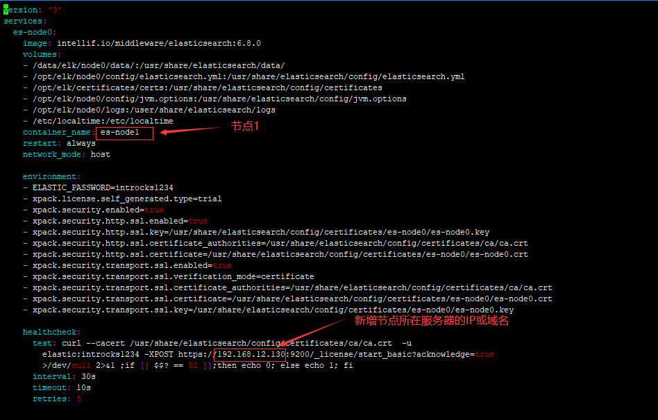
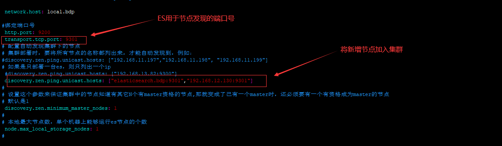
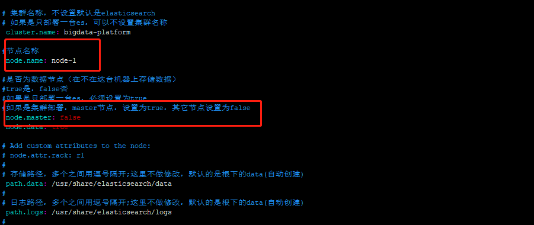
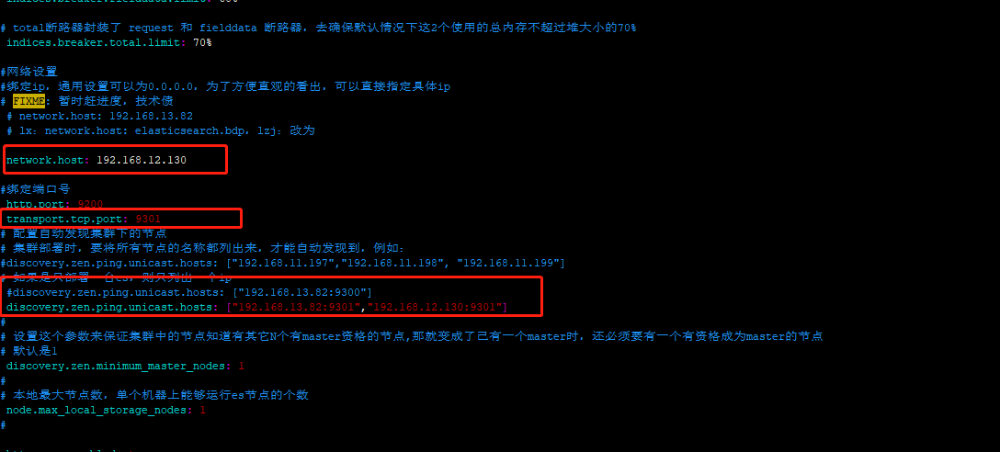
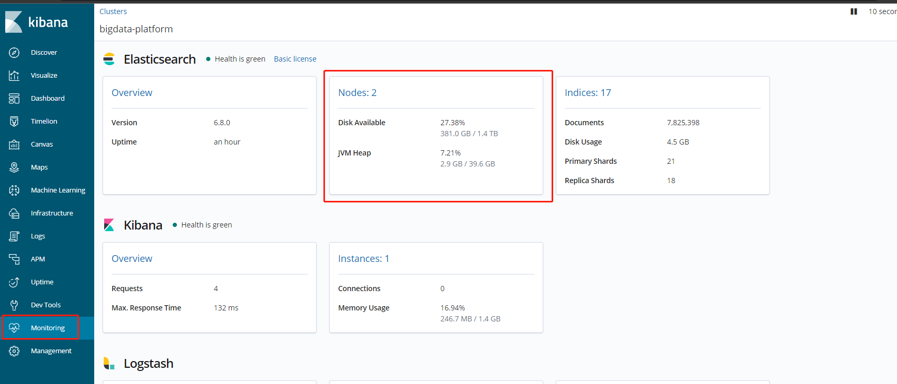

#### Docker-Compose 环境下的Elasticsearch扩节点方法

> *背景：双流现场天图 ES的人员档案事件流的 index bigdata_event 数据量极大，单个index就占用了 1TB的磁盘空间，内存占用25GB左右，经常出现查询耗时长或者直接timeout的情况，基于以上决定对ES扩节点解决此性能问题。*

##### 1.准备一台和新服务器，服务器系统版本和Elasticsearch主节点的保持一致。

##### 2.在新主机上安装Docker以及Docker-Compose环境

1. 在官网环境下载对应版本安装包，地址： https://download.docker.com/linux/static/stable/x86_64/  ，本次选择的是docker-19.03.0.tgz。
2. 准备docker.service 系统配置文件，如下

~~~
docker.service

[Unit]
Description=Docker Application Container Engine
Documentation=https://docs.docker.com
After=network-online.target firewalld.service
Wants=network-online.target

[Service]
Type=notify
# the default is not to use systemd for cgroups because the delegate issues still
# exists and systemd currently does not support the cgroup feature set required
# for containers run by docker
ExecStart=/usr/bin/dockerd
ExecReload=/bin/kill -s HUP $MAINPID
# Having non-zero Limit*s causes performance problems due to accounting overhead
# in the kernel. We recommend using cgroups to do container-local accounting.
LimitNOFILE=infinity
LimitNPROC=infinity
LimitCORE=infinity
# Uncomment TasksMax if your systemd version supports it.
# Only systemd 226 and above support this version.
#TasksMax=infinity
TimeoutStartSec=0
# set delegate yes so that systemd does not reset the cgroups of docker containers
Delegate=yes
# kill only the docker process, not all processes in the cgroup
KillMode=process
# restart the docker process if it exits prematurely
Restart=on-failure
StartLimitBurst=3
StartLimitInterval=60s

[Install]
WantedBy=multi-user.target
~~~

3. 准备Docker安装脚本install.sh

~~~
#!/bin/sh
echo '解压tar包...'
sudo tar -xvf $1
echo '将docker目录移到/usr/bin目录下...'
sudo cp docker/* /usr/bin/
echo '将docker.service 移到/etc/systemd/system/ 目录...'
sudo cp docker.service /etc/systemd/system/
echo '添加文件权限...'
sudo chmod +x /etc/systemd/system/docker.service
echo '重新加载配置文件...'
sudo systemctl daemon-reload
echo '启动docker...'
sudo systemctl start docker
echo '设置开机自启...'
sudo systemctl enable docker.service
echo 'docker安装成功...'
docker -v
~~~

4. 将安装包，docker.service 系统配置文件以及安装脚本install.sh放置在服务器同一系统目录下。
5. 执行install.sh脚本
6. 在GitHub下载Docker-compose对应版本的安装包，地址 https://github.com/docker/compose/releases
7. 将[docker-compose-Linux-x86_64](https://github.com/docker/compose/releases/download/1.25.5/docker-compose-Linux-x86_64)文件移动到服务器/usr/local/bin/ 目录下。

~~~
mv docker-compose-Linux-x86_64 /usr/local/bin/docker-compose
~~~

8. 添加为docker-compose添加执行权限

~~~
chmod +x /usr/local/bin/docker-compose
~~~

9. 执行以下命令验证环境安装结果

~~~
docker-compose -v
docker version
~~~

##### 3.为新主机配置用于ES服务安装的Docker-Compose.yml模板文件

1. 找到主节点下的用于管理docker服务的docker-compose.yml模板文件，并找到其中用于定义Elasticsearch服务的部分，例如下面代码所示：

~~~yaml
  es-node0:
    image: intellif.io/middleware/elasticsearch:6.8.0
    volumes:
    - /bigdata/elk/node0/data:/usr/share/elasticsearch/data
    - /opt/elk/node0/config/elasticsearch.yml:/usr/share/elasticsearch/config/elasticsearch.yml
    - /opt/elk/certificates/certs:/usr/share/elasticsearch/config/certificates
    - /opt/elk/node0/config/jvm.options:/usr/share/elasticsearch/config/jvm.options
      #- /opt/elk/node0/logs:/user/share/elasticsearch/logs
    - /etc/localtime:/etc/localtime
    container_name: es-node0
    restart: always
    network_mode: host

    environment:
    - ELASTIC_PASSWORD=introcks1234
    - xpack.license.self_generated.type=trial
    - xpack.security.enabled=true
    - xpack.security.http.ssl.enabled=true
    - xpack.security.http.ssl.key=/usr/share/elasticsearch/config/certificates/es-node0/es-node0.key
    - xpack.security.http.ssl.certificate_authorities=/usr/share/elasticsearch/config/certificates/ca/ca.crt
    - xpack.security.http.ssl.certificate=/usr/share/elasticsearch/config/certificates/es-node0/es-node0.crt
    - xpack.security.transport.ssl.enabled=true
    - xpack.security.transport.ssl.verification_mode=certificate
    - xpack.security.transport.ssl.certificate_authorities=/usr/share/elasticsearch/config/certificates/ca/ca.crt
    - xpack.security.transport.ssl.certificate=/usr/share/elasticsearch/config/certificates/es-node0/es-node0.crt
    - xpack.security.transport.ssl.key=/usr/share/elasticsearch/config/certificates/es-node0/es-node0.key

    healthcheck:
      test: curl --cacert /usr/share/elasticsearch/config/certificates/ca/ca.crt  -u
        elastic:introcks1234 -XPOST https://elasticsearch.bdp:9200/_license/start_basic?acknowledge=true
        >/dev/null 2>&1 ;if [[ $$? == 52 ]];then echo 0; else echo 1; fi
      interval: 30s
      timeout: 10s
      retries: 5

~~~

2. 根据以上ES服务定义文件，创建es-docker-compose.yml模板如下

##### 4.拷贝安全认证文件

将主节点服务器上的安全认证文件拷贝到新增节点的相同目录下，在本例中将主节点的/opt/elk/certificates/certs/ca以及/opt/elk/certificates/certs/es-node0目录下的所有文件和目录，拷贝到新增服务器的相同目录下。

##### 5.修改Elasticsearch配置文件

1. 将主节点/opt/elk/node0/config目录下的elasticsearch.yml  以及 jvm.options文件，拷贝到新增节点的相同目录下。
2. 主节点下的elasticsearch.yml文件需要做如下修改：

3.新增节点的elasticsearch.yml文件需要做如下修改：

##### 6.重启ES

1. 在主节点上执行docker restart es-node1
2. 在新增节点上执行docker-compose -f /opt/es_docker-compose.yml  up -d 

##### 7.验证

登录kibana，如下看到Nodes增加则扩容成功。

